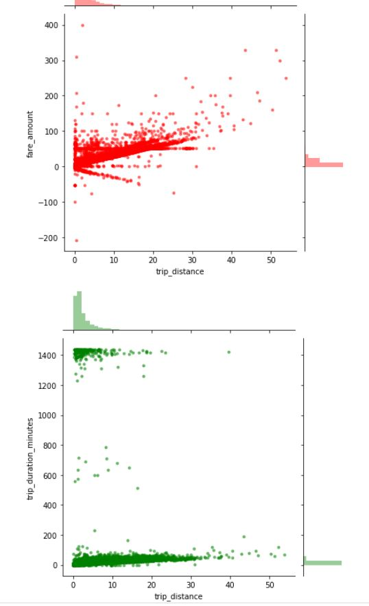

# nyc-taxi data - ingestion and exploration

### Problem statement
1. Download or generate 2 data sets e.g. NYC taxi public data set
2. Upload data to hive external tables using Apache Spark or Apache Nifi or Apache Sqoop.
3. Present collected data in analytical report created with BI tool (e.g. Power BI, Tableau) or Excel.

### Solution statement
1. Use data from NYC taxi public data set.
2. Write ingestion code using apache spark and scala
3. Create analytical report using <strong>Matplotlib library using python in Jupyter notebook</strong>.

### Info on data:
1. Data used is from the publically available NYC Taxi - 'yellow taxi trip records'.
2. Three months data is used (Jan 2020, Feb 2020, March 2020)
3. Total data size used is 1.5 GB approx.
4. Refrence: https://www1.nyc.gov/site/tlc/about/tlc-trip-record-data.page

### Program logic flow
1. Read the csv file.
2. Transform the data by adding schema and date formats.
3. Create the partition column. In this case partition is dynamically created using tpep_pickup_datetime in yyyy-MM format.
4. Create the external hive table automatically by extracting the schema from transformed spark dataframe.
5. Write the partitioned data in the output location using hive insert overwrite statement.
6. Write the test cases.

### source code

A working source code is added in the repo. Test cases are added but are not thoroughly tested.
Before building the code, comment out the test cases as it may give some erors. 

Same ingestion code is executed in a jupyter notebook. And results are displayed.

### jupyter notebooks

There are 2 notebooks.
 

<strong>Data_ingestion.ipynb</strong> has all the source code for ingestion. All the cells are executed and putputs are displayed

<strong>Data_exploration.ipynb</strong> is used for exploring the data and getting insights. Used matplotlib for create histograms, graphs etc. Output of both the notebooks are available for examination.

<strong>Example plot:</strong>

    

   

    
